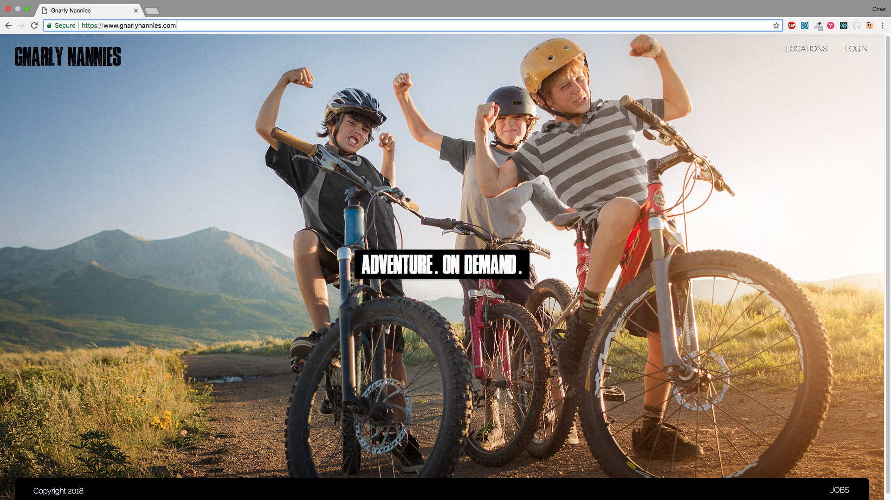

# Gnarly Nannies
On-demand adventure-based childcare community

[Deployed Frontend Link](https://www.gnarlynannies.com/)


<div>
  
</div>

## App Description
Gnarly Nannies is a niche childcare service for busy families with adventurous kids. We pair professional trip leaders in your area with families looking to get their kids outside for the day. Trip experiences range from a ski trip in the mountains, to a sunset surf at your local break. Trip leaders handle everything, from transportation to meals, giving parents a much needed break. Let Gnarly Nannies provide your child with the outdoor experiences they need and deserve!

## Problem Statement
Parents don't have the knowledge, or time to support their children's outdoor sport interests.   Worried about safety, Parents are more inclined to allow their children to play indoors versus outdoors.

Adults who have transitioned out of the camping and education industry have a valuable skill set that is being underutilized. They are excellent mentors, great at leading trips, and typically have an interest in outdoor activities...as well as supplemental income.


## The Solution
Gnarly Nannies is a website that connects the parents of adventurous kids with experienced child educators interested in leading day-long outings. Experiences and prices are outlined by the trip leader and include mountain and water sports. This is a door-to-door service where trip leaders provide transportation, handle all gear rental and  even food purchases (optional), and provide any medical services within their scope of training.


## User Experience
### Finding A Nanny
- User clicks "Locations" link in top right corner of window
- Select desired city to view available nannies
- Filter results using the "Refine Search" section 
- Click on desired nanny for additional information
- Email nannies using provided form

### Become A Nanny
- Click on "Jobs" link in bottom right corner of window
- Fill out Application and submit

## Installation Instructions
Using the app only requires visiting the website, https://www.gnarlynannies.com/.

However, if you wish to download the app and make changes to better suit your personal needs, you will find the source code here: 

https://github.com/chasfricke/capstone-FE
- Launch Instructions: "npm start"

https://github.com/chasfricke/capstone-BE
- Launch Instructions: "nodemon app"

After forking over your desired repo and cloning it down to your computer, please ```npm install``` then happy hacking!

## Technologies
React, Express, Knex, Postgresql, Node, Nodemailer.

## Author
Chas Fricke - Full Stack Web Developer - Denver, Colorado
[LinkedIn](https://www.linkedin.com/in/chas-fricke/)

## License
MIT